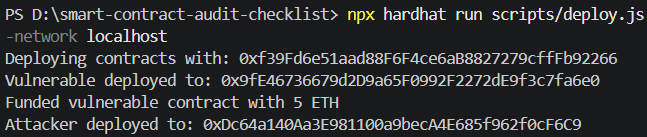
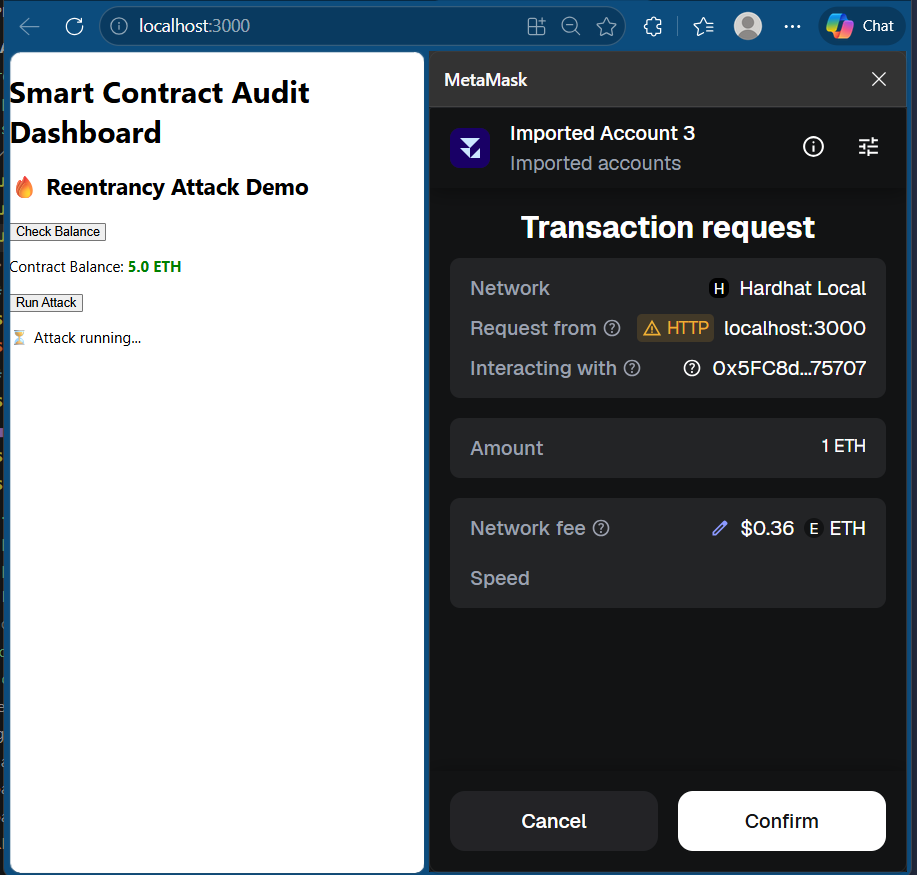
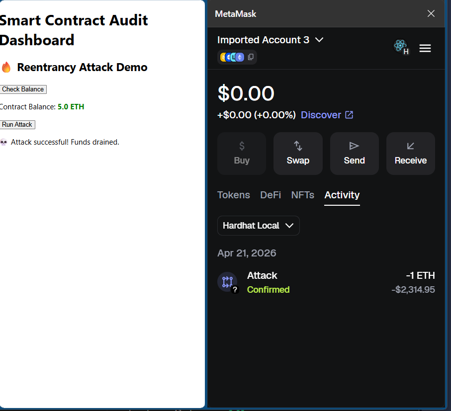
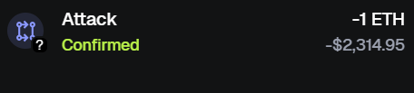

<h1 align="center">Smart Contract Audit Checklist</h1>

  A security-focused project demonstrating real-world smart contract vulnerabilities and their fixes using Hardhat.

  
  
  
  
   

---

##  Project Structure

smart-contract-audit-checklist/
│
├── contracts/
│   ├── vulnerable/
│   │   ├── Reentrancy.sol
│   │   ├── AccessControl.sol
│   │   └── Overflow.sol
│   │
│   ├── fixed/
│   │   ├── ReentrancyFixed.sol
│   │   ├── AccessControlFixed.sol
│   │   └── OverflowFixed.sol
│   │
│   └── attacker/              
│       ├── ReentrancyAttack.sol
│       └── AccessControlAttack.sol
│
├── scripts/
│   ├── deploy.js              ✅ deploy + fund
│   └── analyze.js
│
├── test/
│   ├── reentrancy.test.js
│   ├── access-control.test.js
│   └── overflow.test.js
│
├── attacks/                   
│   ├── reentrancy.md
│   ├── access-control.md
│   └── overflow.md
│
├── checklist/
│   └── audit-checklist.md
│
├── frontend/                  
│   └── ...
│
└── README.md

---

## Purpose

This repository demonstrates how to:

- Identify critical smart contract vulnerabilities
- Exploit insecure implementations
- Apply secure fixes
- Validate security using automated tests

---

## Covered Vulnerabilities

---

### 1. Reentrancy Attack

#### Issue:

- External call before state update allows attacker to re-enter contract.

#### Impact:

-Funds can be drained.

#### Fix:

- Use Checks-Effects-Interactions pattern
- Use ReentrancyGuard

#### Attack Demo:

##### Steps
1. Contract is funded with 5 ETH
2. Attacker contract exploits reentrancy
3. Funds are drained completely

##### Result
Before Attack: 5 ETH  
After Attack: 0 ETH

##### Vulnerability
The contract sends ETH before updating balance, allowing repeated withdrawals.

 

#### Cases:

1. Vulnerable case (attack works)
   
2. Fixed case (attack fails)
   
<<<<<<< HEAD

#### Frontend Show:

=======
>>>>>>> 6f99ed26573cd1ab819e4aad0667c66562ebf868

---

### 2. Access Control Vulnerability

#### Issue:

- Functions lack proper authorization checks.

#### Impact:

- Unauthorized users can take ownership or execute privileged actions.

#### Fix:

- Implement onlyOwner
- Use role-based access control

#### Cases:

1. Vulnerable case (attack works)

2. Fixed case (attack fails)

---

### 3. Integer Overflow

#### Issue:

- Unchecked arithmetic leads to overflow.

#### Impact:

- Incorrect balances or broken logic.

#### Fix:

- Use Solidity ≥0.8 (built-in checks)
- Avoid unchecked unless necessary

#### Cases:

1. Vulnerable case (attack works)

2. Fixed case (attack fails)

---

## Testing Strategy

Each vulnerability includes:

- Exploit test (proves vulnerability exists)
- Fix test (proves vulnerability is mitigated)

Run all tests:

npx hardhat test

---

## Setup

npm install
npx hardhat compile
npx hardhat test

---

## Audit Checklist

### Located in:

checklist/audit-checklist.md

### Includes:

- Access control review
- Reentrancy checks
- Arithmetic safety
- Gas optimization hints
- Storage layout validation

---

## Skills Demonstrated

- Smart contract security analysis
- Writing exploit simulations
- Secure Solidity development
- Hardhat testing framework
- Vulnerability reproduction & mitigation

---

## How to Run if you want frontend

### 1. Start local node:
npx hardhat node

### 2. Deploy contracts:
npx hardhat run scripts/deploy.js --network localhost

### 3. Start frontend:
cd frontend
npm start

---

## Acknowledgement

This project was developed by @bizzorotical-ank01 as part of a focused journey into smart contract security and auditing.

It is designed for educational and practical purposes, simulating real-world DeFi vulnerabilities to help developers understand:

- How security flaws occur in smart contracts
- How attackers exploit these vulnerabilities
- How to implement secure and robust fixes

This repository serves as a hands-on learning resource for developers aiming to improve their skills in smart contract security and auditing.

Feel free to explore the code and documentation in this repository.

If you have any questions or suggestions, Let's Connect, Till then GOOD LUCK BUDDY!
